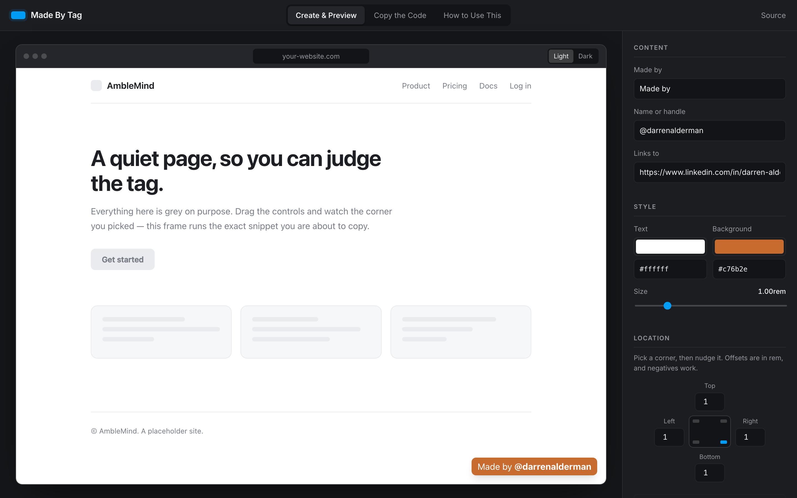
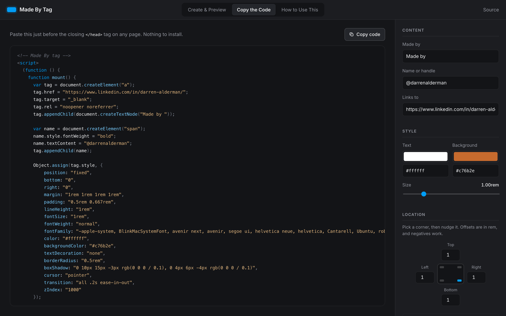
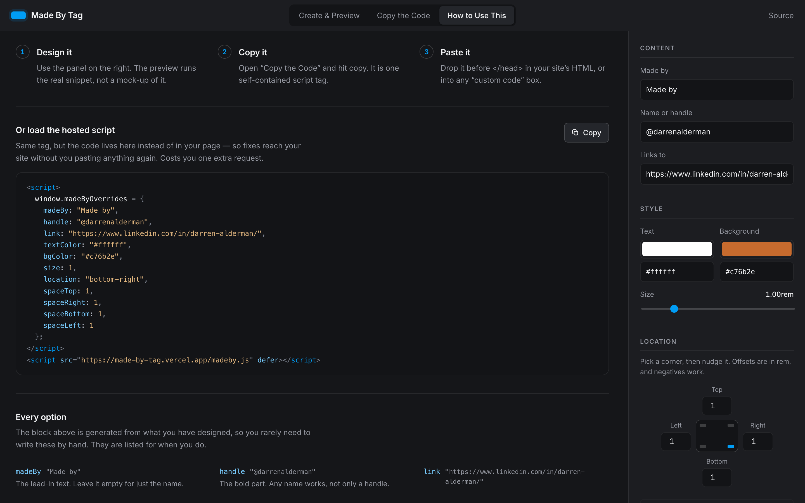

# Made By Tag

Design a floating “Made by” link for your website, watch it on a real page, and walk away with one
self-contained `<script>` tag. No build step, no dependencies, no account.

**[Try it →](https://made-by-tag.vercel.app)**



---

## The idea

Plenty of sites carry a small “Made by …” badge in the corner. Writing one is ten minutes of fiddling
with `position: fixed` and then guessing at the colours. This does the fiddling for you and hands back
the finished code.

The part worth knowing: **the preview is not a mock-up of the tag — it is the tag.** The panel builds
one snippet string, the code view shows you that string, and the preview iframe executes that same
string on a placeholder page. There is no second implementation to fall out of sync, so what you see
is what your site gets.

<table>
  <tr>
    <td width="50%"></td>
    <td width="50%"></td>
  </tr>
  <tr>
    <td>The snippet it writes for you, highlighted and one click from your clipboard.</td>
    <td>The hosted-script alternative, generated from whatever you just designed.</td>
  </tr>
</table>

The light/dark switch above the preview is there because your tag has to sit on top of a page it does
not control, and a colour that reads on white can vanish on charcoal.

## Installing the tag

### The snippet (recommended)

Design it in the app, hit **Copy code**, and paste the result before your closing `</head>`. It is
plain DOM code with nothing to fetch — the tag survives this project disappearing entirely.

### The hosted script

If you would rather have fixes reach your site without re-pasting, load the script instead and
describe the design in `window.madeByOverrides`:

```html
<script>
  window.madeByOverrides = {
    madeBy: "Made by",
    handle: "@darrenalderman",
    link: "https://www.linkedin.com/in/darren-alderman/",
    textColor: "#ffffff",
    bgColor: "#c76b2e",
    size: 1,
    location: "bottom-right",
    spaceTop: 1, spaceRight: 1, spaceBottom: 1, spaceLeft: 1
  };
</script>
<script src="https://made-by-tag.vercel.app/madeby.js" defer></script>
```

The **How to Use This** tab generates this block from whatever you have designed, so you do not have
to hand-write it.

The older form still works, and still defaults to a Twitter handle:

```html
<script id="madeby-fm" src="https://made-by-tag.vercel.app/madeby.js" data-twitter-handle="darrenalderman" defer></script>
```

### Options

| Option | Default | What it does |
| --- | --- | --- |
| `madeBy` | `"Made by"` | The lead-in text. Leave it empty for just the name. |
| `handle` | `"@darrenalderman"` | The bold part. Any name works, not only a handle. |
| `link` | a LinkedIn profile | Where the tag points. |
| `textColor` | `"#ffffff"` | Text colour. |
| `bgColor` | `"#c76b2e"` | Tile colour. |
| `size` | `1` | Scales text, padding and corner radius together, in rem. |
| `location` | `"bottom-right"` | `top-left`, `top-right`, `bottom-left` or `bottom-right`. |
| `spaceTop` … `spaceLeft` | `1` | Offset from the edges, in rem. Negatives push it off-screen. |

For anything the options do not cover, `window.madeByCss` is merged over the finished styles last:

```html
<script>
  window.madeByCss = { borderRadius: "0", fontFamily: "Georgia, serif" };
</script>
```

## Running it locally

```bash
npm install
npm run dev
```

`npm run build` runs twice: once for the app, and once more to emit `dist/madeby.js` — the hosted
script, bundled from the same `src/lib/tag.js` the builder uses. That second pass is deliberate. When
the builder and the hosted script lived in separate repositories they quietly drifted apart, and one
grew features the other never got.

## Notes

- The tag is a plain `<a>` with inline styles and `z-index: 1000`. A site with its own fixed elements
  in that corner will need the offsets nudged.
- Text is written with `textContent`, and every value in the generated snippet goes through
  `JSON.stringify` — so an apostrophe, a quote or a literal `</script>` in your name cannot break the
  code you paste.
- The script listens for `DOMContentLoaded` rather than assigning `window.onload`, which would have
  replaced whatever load handler your site already had.
- The preview iframe is sandboxed without `allow-same-origin`, so the snippet runs in an opaque origin
  and cannot reach back into the builder.

## This repo replaces two

It used to be split in half, which is where the drift came from:

- `amblemind/fm` — “Freakin' Magical”, a planned collection of copy-and-paste site widgets. Made By was
  the only one that got built, so the collection framing and its sidebar are gone. That repository is
  now this one, renamed to `made-by-tag`.
- `amblemind/madeby` — the standalone script, published for jsDelivr.

Both now live here. The old jsDelivr URL still resolves as long as that repository stays up, so archive
it rather than deleting it.

## Built with

[Svelte 5](https://svelte.dev), [Vite](https://vite.dev), [Prism](https://prismjs.com) for the code
view, and [Inter](https://rsms.me/inter/). Deployed on [Vercel](https://vercel.com).

## License

MIT — see [LICENSE](LICENSE).
